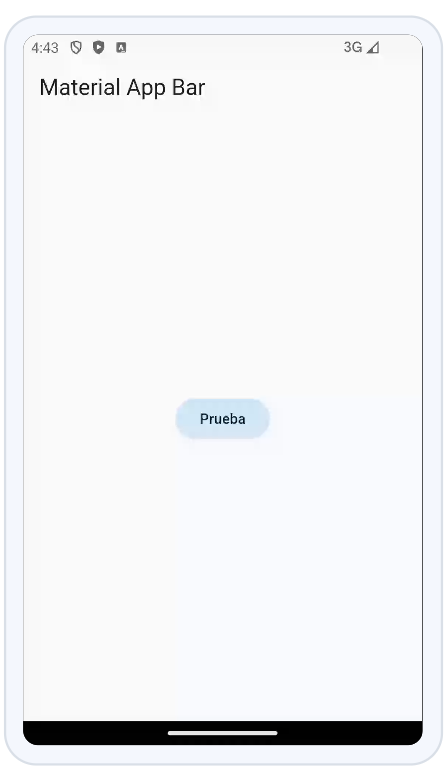
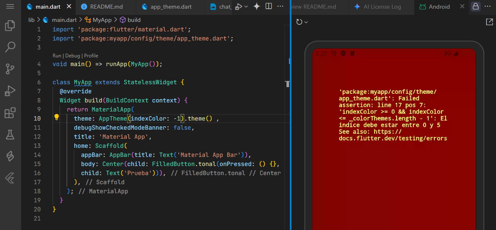
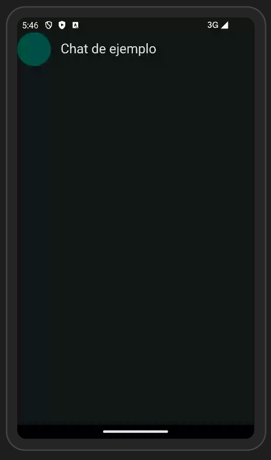
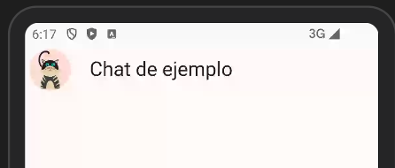
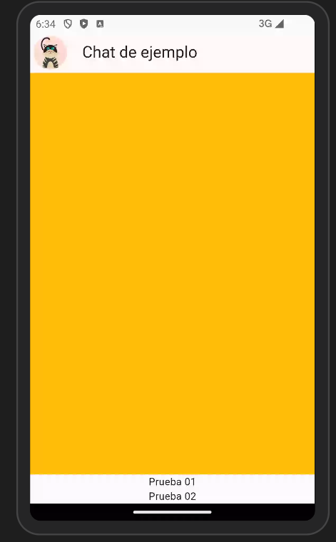
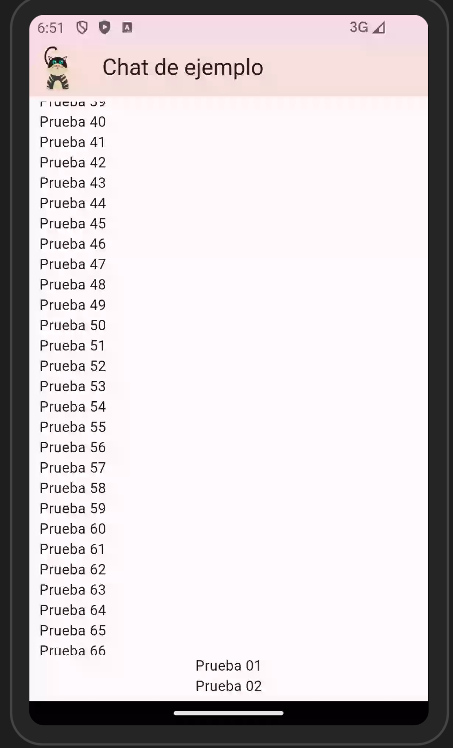

# chat_app

<!-- Suggested code may be subject to a license. Learn more: ~LicenseLog:3463883920. -->
<!-- Suggested code may be subject to a license. Learn more: ~LicenseLog:2517100940. -->

Se generará una aplicación que contenga un chat y cargue imágenes y texto dentro de la misma.

## Create first step

```dart
import 'package:flutter/material.dart';

void main() => runApp(MyApp());

class MyApp extends StatelessWidget {
  @override
  Widget build(BuildContext context) {
    return MaterialApp(
      debugShowCheckedModeBanner: false,
      title: 'Material App',
      home: Scaffold(
        appBar: AppBar(title: Text('Material App Bar')),
        body: Center(child: FilledButton.tonal(onPressed: () {}, 
        child: Text('Prueba'))),
      ),
    );
  }
}
```

## create lib/config/theme/app_theme.dart

Se genera una clase para configurar el tema de la app

```dart
import 'package:flutter/material.dart';

class AppTheme {
  ThemeData theme() {
    return ThemeData();
  }
}

```

* Agregar el archivo a la carpeta lib/config/theme/

* Enseguida, agregar este archivo main.dart dentro de la definición del `theme: ` donde se hace referencia a la nueva clase.

* Invocar esta clase llamando al método `theme()`.

* notar que se debe agregar automáticamente o usando `Control + .` la agregación de la referencia al archivo `import 'package:myapp/config/theme/app_theme.dart';
`

Deberá verse la siguiente app:




## funcionalidad de cambio de tema

Agregar los cambios que consideren

```dart
import 'package:flutter/material.dart';

class AppTheme {
  //variable privada inicia con _
  final Color _customColor = Color(0xFF49149f);

  final List<Color> _colorThemes = [
    Colors.red,
    Colors.blue,
    Colors.yellow,
    Colors.green,
    Colors.orange,
    Colors.teal,
  ];
  ThemeData theme() {
    return ThemeData(useMaterial3: true, colorSchemeSeed: _colorThemes[1]);
  }
}

```

### Uso de un ínidic
```dart
import 'package:flutter/material.dart';

class AppTheme {
  final int indexColor;

  final List<Color> _colorThemes = [
    Colors.red,
    Colors.blue,
    Colors.yellow,
    Colors.green,
    Colors.orange,
    Colors.teal,
  ];

  AppTheme({this.indexColor = 0}) {
    assert(
      indexColor >= 0 && indexColor <= _colorThemes.length - 1,
      'El indice debe estar entre 0 y ${_colorThemes.length - 1}',
    );
  }

  ThemeData theme() {
    return ThemeData(
      useMaterial3: true,
      colorSchemeSeed: _colorThemes[indexColor],
    );
  }
}

```

La aserción puede probarse al llamar desde el main

```dart
theme: AppTheme(indexColor: -1).theme() ,
```


```dart
theme: AppTheme(indexColor: 11).theme() ,
```




<!-- Suggested code may be subject to a license. Learn more: ~LicenseLog:1362790887. -->
## Creación de la clase ChatScreen
Los comentarios muestran los snippets para crear el archivo en la carpeta lib/view/chat/chat_screen.dart

```dart
//impm
import 'package:flutter/material.dart';

//stleswi

class ChatScreen extends StatelessWidget {
  const ChatScreen({super.key});

  @override
  Widget build(BuildContext context) {
    return const Placeholder();
  }
}
```
## Modificación para una pantalla básica para la app

Modificación de la pantalla de presentación
```dart
//impm
import 'package:flutter/material.dart';

//stleswi

class ChatScreen extends StatelessWidget {
  const ChatScreen({super.key});

  @override
  Widget build(BuildContext context) {
    return Scaffold(
      appBar: AppBar(
        title: Text("Chat de ejemplo"),
        centerTitle: false,
        leading: CircleAvatar(),
      ),
    );
  }
}

```

### Invocación desde el main

```dart
return MaterialApp(
      theme: AppTheme(indexColor: 5).theme() ,
      debugShowCheckedModeBanner: false,
      title: 'Material App',
      home: ChatScreen(), // borrar Scaffold
    );
```



## Agregar imagen del avatar

Modificar el archivo `pubspec.yaml` en la raiz del proyecto.
Crear la carpeta indicada y poner las imágenes o imagen que se desee usar en la aplicación.

```yml
flutter:

  # The following line ensures that the Material Icons font is
  # included with your application, so that you can use the icons in
  # the material Icons class.
  uses-material-design: true

  # To add assets to your application, add an assets section, like this:
  assets:
    - assets/avatars/
```


```dart
//impm
import 'package:flutter/material.dart';

//stleswi

class ChatScreen extends StatelessWidget {
  const ChatScreen({super.key});

  @override
  Widget build(BuildContext context) {
    return Scaffold(
      appBar: AppBar(
        title: Text("Chat de ejemplo"),
        centerTitle: false,
        leading: Padding(
          padding: EdgeInsets.all(5.0),
          child: CircleAvatar(
            backgroundImage: // NetworkImage("https://img.itch.zone/aW1hZ2UvMTk0MTE3NC8xMTQxMjU5Mi5qcGc=/original/js5a6b.jpg")
            AssetImage("assets/avatars/cat2.jpg"),
            //AssetImage('assets/avatars/cat01.webp'),
          ),
        ),
      ),
    );
  }
}

```
* Se puede usar una imagen extraida de la red como se muestra en el comentario `NetworkImage("https://img.itch.zone/aW1hZ2UvMTk0MTE3NC8xMTQxMjU5Mi5qcGc=/original/js5a6b.jpg")`

* Probar ambas opciones.




## Creación del contenedor para el cuerpo de la app

```dart
import 'package:flutter/material.dart';

class ChatScreen extends StatelessWidget {
  const ChatScreen({super.key});

  @override
  Widget build(BuildContext context) {
    return Scaffold(
      // ... agregar el body (dejar el resto)
      body: _ChatView(),  //Column() --> (control + . ) extract Widget
    );
  }
}

// se genera esta clase
class _ChatView extends StatelessWidget {
  const _ChatView({
    super.key,
  });

  @override
  Widget build(BuildContext context) {
    return Column();
  }
} 

```


```dart

class _ChatView extends StatelessWidget {
  const _ChatView({super.key});

  @override
  Widget build(BuildContext context) {
    return Column(children: [Text('Prueba 01'), Text('Prueba 02')]);
  }
}


```

```dart
class _ChatView extends StatelessWidget {
  const _ChatView({super.key});

  @override
  Widget build(BuildContext context) {
    return SafeArea(
      child: Column(
        children: [
          Expanded(child: Container(color: Colors.amber)),
          Text('Prueba 01'),
          Text('Prueba 02'),
        ],
      ),
    );
  }
}
```



```dart
//impm
import 'package:flutter/material.dart';

//stleswi

class ChatScreen extends StatelessWidget {
  const ChatScreen({super.key});

  @override
  Widget build(BuildContext context) {
    return Scaffold(
      appBar: AppBar(
        title: const Text("Chat de ejemplo"),
        centerTitle: false,
        leading: const Padding(
          padding: EdgeInsets.all(5.0),
          child: CircleAvatar(
            backgroundImage: // NetworkImage("https://img.itch.zone/aW1hZ2UvMTk0MTE3NC8xMTQxMjU5Mi5qcGc=/original/js5a6b.jpg")
            //AssetImage("assets/avatars/cat2.jpg"),
            AssetImage('assets/avatars/cat01.webp'),
          ),
        ),
      ),
      body: _ChatView(), //Column() --> (control + . ) extract Widget
    );
  }
}

class _ChatView extends StatelessWidget {
  //const _ChatView({super.key});

  get itemBuilder => null;

  @override
  Widget build(BuildContext context) {
    return SafeArea(
      child: Padding(
        //padding: const EdgeInsets.all(8.0),
        //padding: EdgeInsets.all(15),
        padding: const EdgeInsets.symmetric(horizontal: 10, vertical: 5),
        child: Column(
          children: [
            //Expanded(child: Container(color: Colors.amber)),
            Expanded(
              child: ListView.builder(
                itemCount: 100,
                itemBuilder: (context, index) {
                  return Text('Prueba $index');
                },
              ),
            ),
            
            Text('Prueba 01'),
            Text('Prueba 02'),
          ],
        ),
      ),
    );
  }
}

```



```dart

```

```dart

```

## Crear un zip del proyecto
```bash
  zip -r chat-project.zip  lib/ pubspec.yaml README.md  assets/ images/
```


